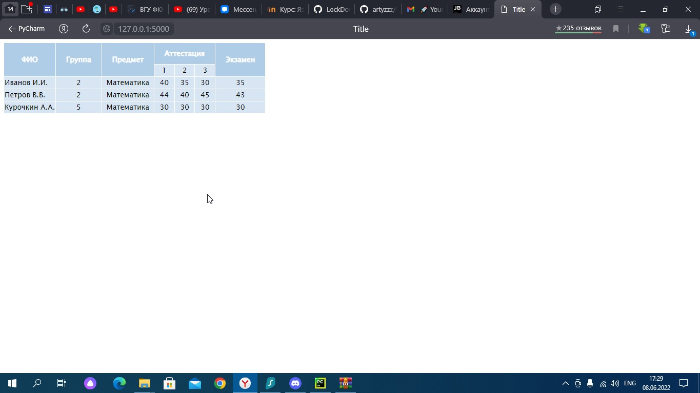

# Web Excel

## Proskurin Artem, VSU, Information Security, course 2

## Desciption
1. Приложение, которое выводит информацию из Exсel таблицы в Web.Приложение написано на фреймворке ```Flask```. В разработке так же была использована следующая библиотека:
```
import openpyxl- библиотека Python для чтения/записи форматов Office Open XML 
```
2. На вход подается Excel таблица, содержимое которой выводится на странице. Доступны следующие форматы: 
```
xlsx
xlsm 
xltx
xltm
```

## Environment

http://127.0.0.1:5000 - после запуска приложения, необходимо перейти по адресу


## Application

